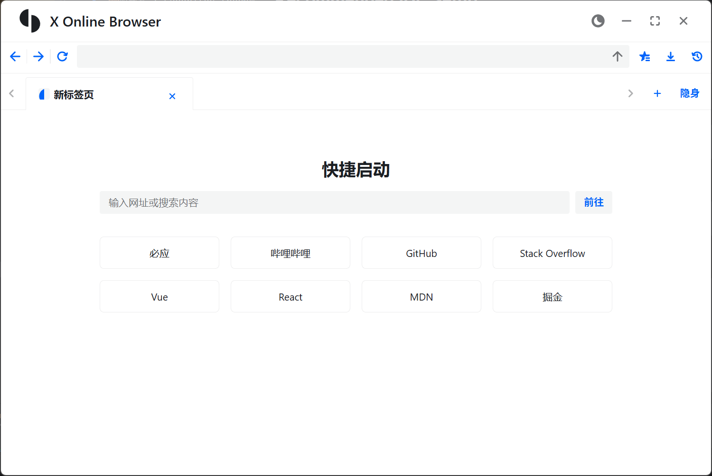
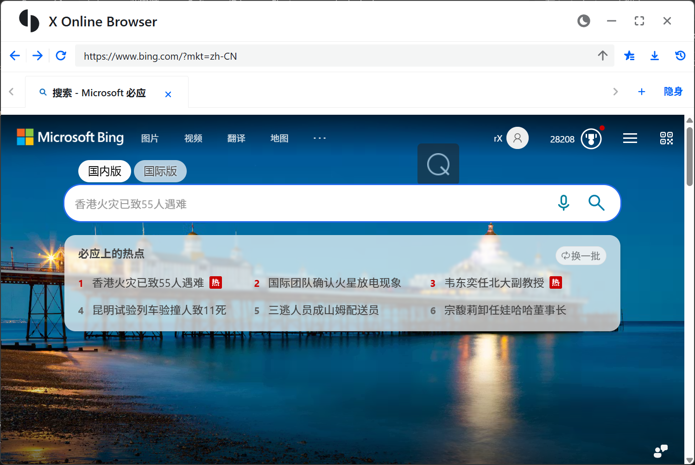

# X Online Browser

X Online Browser is a cross-platform desktop web browser demo built with Electron, React and TypeScript. It showcases how to wrap a native WebView in Electron and build a modern browsing experience with multi-tab management, incognito mode, bookmarks, downloads and more.

X Online Browser 是一个基于 Electron、React 和 TypeScript 构建的跨平台桌面浏览器示例，集成多标签浏览、隐身标签页、收藏夹、下载管理等常见功能，用于演示如何在 Electron 中封装原生 WebView 并搭建现代浏览体验，可作为学习与二次开发的基础模板。

## 技术栈 / Tech Stack

- **主框架 / Main Framework**: Electron, React, TypeScript
- **构建工具 / Build Tools**: Vite, electron-vite, electron-builder
- **UI 组件 / UI Components**: @douyinfe/semi-ui, @douyinfe/semi-icons
- **拖拽 & 布局 / Drag & Drop & Layout**: @dnd-kit/core, @dnd-kit/sortable, @dnd-kit/modifiers, @dnd-kit/utilities
- **数据表格 / Data Grid**: ag-grid-react, ag-grid-enterprise
- **应用工具 / App Utilities**: electron-store, electron-updater, uuid
- **代码质量 / Code Quality**: ESLint, Prettier, TypeScript

## 功能特性 / Features

- **多标签浏览 / Multi-tab browsing**：支持新建、关闭标签页，标签栏拖拽排序，自动管理当前活动标签。
- **隐身标签页 / Incognito tabs**：隐身标签页使用内存缓存，不写入浏览历史，关闭后不留痕迹。
- **自定义首页 / Custom home page**：新建标签页展示快捷启动页，提供常用站点卡片和搜索/地址输入框。
- **地址栏与搜索 / Address bar & search**：支持直接输入网址或关键词，未匹配网址时自动使用 Bing 搜索。
- **基础导航 / Basic navigation**：提供后退、前进、刷新等常用浏览控制按钮。
- **浏览历史 / Browsing history**：自动记录访问记录，支持列表查看、关键词搜索、单条删除及一键清空历史。
- **收藏夹 / Favorites (bookmarks)**：一键添加/取消当前页面到收藏夹，列表展示、从收藏打开和删除收藏记录。
- **下载管理 / Downloads manager**：集中展示下载任务，实时进度和速度估算，支持取消下载、打开文件/文件夹、删除下载记录。
- **可拖拽标签栏 / Draggable tab bar**：基于 dnd-kit 实现标签顺序拖拽排序，保持标签页内容状态不丢失。
- **自定义窗口标题栏 / Custom window title bar**：使用 Semi-UI 自绘窗口标题栏，支持最小化、最大化/还原、关闭窗口。
- **深色模式切换 / Dark mode toggle**：支持浅色/深色主题一键切换。
- **原生 WebView 封装 / Native WebView wrapper**：封装 Electron WebView，统一处理页面加载完成/失败、标题更新、图标更新、URL 变更等事件。
- **分区与缓存控制 / Partition & cache control**：支持默认、持久化、内存等缓存策略，按标签页隔离会话和缓存。
- **Cookie 管理 / Cookie management**：提供设置、获取、删除 Cookie 的能力，通过 Electron IPC 与主进程交互。
- **多平台构建脚本 / Cross-platform build scripts**：预置 Windows / macOS / Linux 的打包命令。

## 界面预览 / Screenshots





## Recommended IDE Setup

- [VSCode](https://code.visualstudio.com/) + [ESLint](https://marketplace.visualstudio.com/items?itemName=dbaeumer.vscode-eslint) + [Prettier](https://marketplace.visualstudio.com/items?itemName=esbenp.prettier-vscode)

## Project Setup

### Install

```bash
$ yarn
```

### Development

```bash
$ yarn dev
```

### Build

```bash
# For windows
$ yarn build:win

# For macOS
$ yarn build:mac

# For Linux
$ yarn build:linux
```
